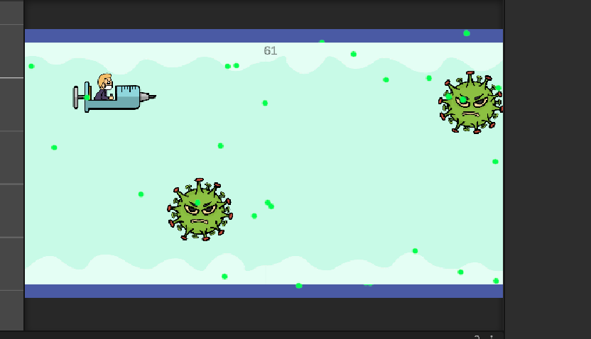
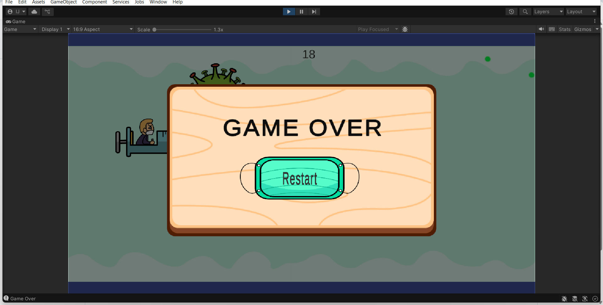

# Feathery Flight

## About
A 2D endless runner game built in Unity featuring physics-based movement, obstacles, scoring mechanics, and UI systems.

## Features
- Endless gameplay
- Obstacle spawning
- Score tracking
- Physics movement

## Technologies Used
- Unity
- C#

## Screenshots

